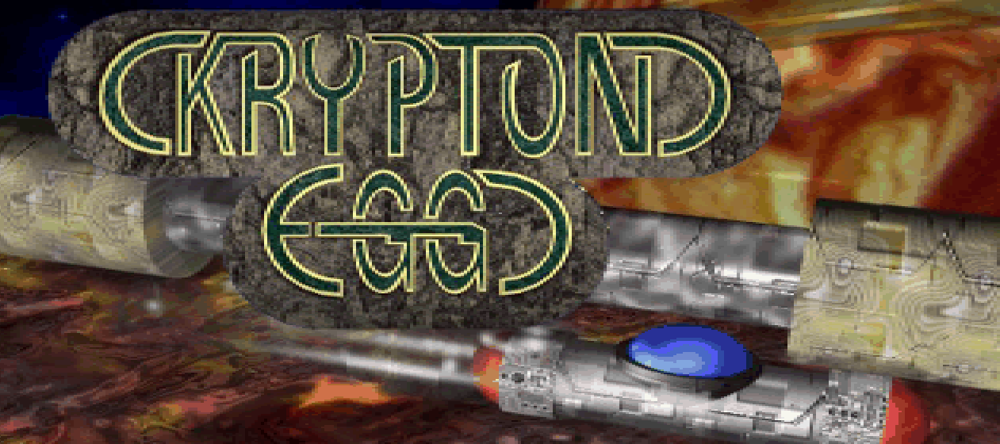
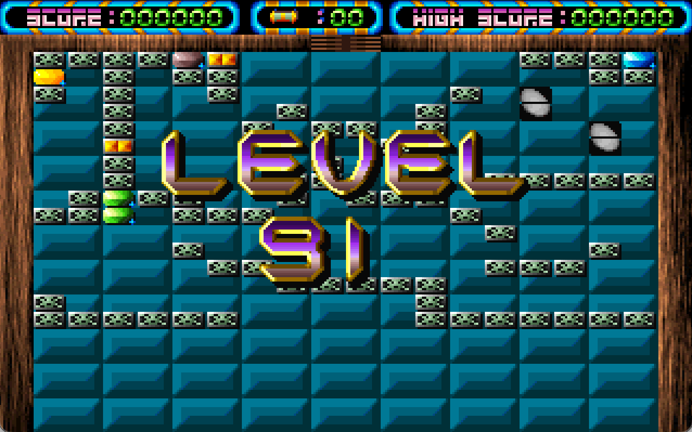

# Krypton Egg The Ultimate Breakout (1994/1996) Game Code Generator

A small utility for generating **Krypton Egg (1994/1996)** resume codes.

Krypton Egg is a classic DOS-era “breakout/Arkanoid-like” game: you clear bricks, collect power-ups, and progress through themed stages. Like many games of the time, it uses short “stage codes” so you have checkpoints or can resume playing from the level.

The game comes in several different versions. Based on what I've found, there are versions 1.1, 2.1, and 4.0. Versions 1.1 and 2.1 each have 60 levels, while version 4.0 includes 100 levels.

[Version 1.1 from Classic Reload](https://classicreload.com/krypton-egg.html)
[Version 2.1 from Archive.org](https://archive.org/download/exov5_2/eXo/eXoDOS/)
[Version 4.0 from Developer site](http://chiliconvalley.online.fr/games/keuk/start.htm)
[Version 4.0 from Archive.org](https://archive.org/details/c2v-game-suite/00_Front.jpg)

## How Krypton Egg stage codes work

For every 10 levels you complete in Krypton Egg, you get a 4-character code (4 hexadecimal digits: `0-9` and `A-F`). That code encodes the stage you reached (`11`, `21`, `31`, …), and how many lives you will start with, so you can resume the game from that point.

I found this partial [code table for version 2.1](http://bmxfrance.free.fr/cedr/krypton.html), which I used to reverse engineering the codes for version 2.1

For 4.0 version, I used [**DOSBox-X**](https://dosbox-x.com) to save and restore the program state and systematically complete levels with controlled life counts, producing a truth table for testing:

I didn't reverse-engineer version 1.1, but the codes differ across versions. So, to obtain the codes for this version, you'd need to confirm they're generated in the same way and then extract the XOR ciphers.

The stage codes are **four hexadecimal digits** and encode level + lives in the same overall concept for all versions:

| Checksum A | Checksum B | Level | Lives encoded | Lives checksum |
|-----------:|-----------:|------:|--------------:|---------------:|

- **Checksum A** and **Checksum B** are a bit obscure — see the source code for how they're derived.
- **Level** is stored as an unsigned integer (**3 bits** for versions 2.1, **4 bits** for version 4.0) with no encryption.
- **Lives** are encoded with an XOR cipher that is static per game version.
- **Lives checksum** is also XOR encoded, but varies by game version and each stage (`11`, `21`, `31`, …).

Because the live checksums XOR ciphers are only **4 bits**, they can be bruteforced fairly easily.

## Using a stage code in the game

For convenience, this repo includes a full table of codes, but you can also run the algorithms to generate codes yourself.

You use the code by:
1. Launch the game
2. In the main menu, press **Space**
3. Type the 4-digit code
4. Press **Enter**
5. Press **Play**

If you did it right, you'll see this:

### Table of codes for version with 60 levels

| Lives | Level 1 | Level 2 | Level 3 | Level 4 | Level 5 |
|-------|-------|-------|-------|-------|-------|
| 10 | 2B3B | 273C | 33D | 1F3E | 3B3F |

  
<b>Expand to see full table.</b> Show code table for version with <b>60 levels</b>

| Lives | Level 1 | Level 2 | Level 3 | Level 4 | Level 5 |
|-------|-------|-------|-------|-------|-------|
| 0 | AB99 | A79E | 839F | 9F9C | BB9D |
| 1 | EB89 | E78E | C38F | DF8C | FB8D |
| 2 | BB9 | 7BE | 23BF | 3FBC | 1BBD |
| 3 | 4BA9 | 47AE | 63AF | 7FAC | 5BAD |
| 4 | ABD8 | A7DF | 83DE | 9FDD | BBDC |
| 5 | EBC8 | E7CF | C3CE | DFCD | FBCC |
| 6 | BF8 | 7FF | 23FE | 3FFD | 1BFC |
| 7 | 4BE8 | 47EF | 63EE | 7FED | 5BEC |
| 8 | 8B1B | 871C | A31D | BF1E | 9B1F |
| 9 | CB0B | C70C | E30D | FF0E | DB0F |
| 10 | 2B3B | 273C | 33D | 1F3E | 3B3F |
| 11 | 6B2B | 672C | 432D | 5F2E | 7B2F |
| 12 | 8B5A | 875D | A35C | BF5F | 9B5E |
| 13 | CB4A | C74D | E34C | FF4F | DB4E |
| 14 | 2B7A | 277D | 37C | 1F7F | 3B7E |
| 15 | 6B6A | 676D | 436C | 5F6F | 7B6E |
| 16 | AA9D | A69A | 829B | 9E98 | BA99 |
| 17 | EA8D | E68A | C28B | DE88 | FA89 |
| 18 | ABD | 6BA | 22BB | 3EB8 | 1AB9 |
| 19 | 4AAD | 46AA | 62AB | 7EA8 | 5AA9 |
| 20 | AADC | A6DB | 82DA | 9ED9 | BAD8 |
| 21 | EACC | E6CB | C2CA | DEC9 | FAC8 |
| 22 | AFC | 6FB | 22FA | 3EF9 | 1AF8 |
| 23 | 4AEC | 46EB | 62EA | 7EE9 | 5AE8 |
| 24 | 8A1F | 8618 | A219 | BE1A | 9A1B |
| 25 | CA0F | C608 | E209 | FE0A | DA0B |
| 26 | 2A3F | 2638 | 239 | 1E3A | 3A3B |
| 27 | 6A2F | 6628 | 4229 | 5E2A | 7A2B |
| 28 | 8A5E | 8659 | A258 | BE5B | 9A5A |
| 29 | CA4E | C649 | E248 | FE4B | DA4A |
| 30 | 2A7E | 2679 | 278 | 1E7B | 3A7A |
| 31 | 6A6E | 6669 | 4268 | 5E6B | 7A6A |
| 32 | A991 | A596 | 8197 | 9D94 | B995 |
| 33 | E981 | E586 | C187 | DD84 | F985 |
| 34 | 9B1 | 5B6 | 21B7 | 3DB4 | 19B5 |
| 35 | 49A1 | 45A6 | 61A7 | 7DA4 | 59A5 |
| 36 | A9D0 | A5D7 | 81D6 | 9DD5 | B9D4 |
| 37 | E9C0 | E5C7 | C1C6 | DDC5 | F9C4 |
| 38 | 9F0 | 5F7 | 21F6 | 3DF5 | 19F4 |
| 39 | 49E0 | 45E7 | 61E6 | 7DE5 | 59E4 |
| 40 | 8913 | 8514 | A115 | BD16 | 9917 |
| 41 | C903 | C504 | E105 | FD06 | D907 |
| 42 | 2933 | 2534 | 135 | 1D36 | 3937 |
| 43 | 6923 | 6524 | 4125 | 5D26 | 7927 |
| 44 | 8952 | 8555 | A154 | BD57 | 9956 |
| 45 | C942 | C545 | E144 | FD47 | D946 |
| 46 | 2972 | 2575 | 174 | 1D77 | 3976 |
| 47 | 6962 | 6565 | 4164 | 5D67 | 7966 |
| 48 | A895 | A492 | 8093 | 9C90 | B891 |
| 49 | E885 | E482 | C083 | DC80 | F881 |
| 50 | 8B5 | 4B2 | 20B3 | 3CB0 | 18B1 |
| 51 | 48A5 | 44A2 | 60A3 | 7CA0 | 58A1 |
| 52 | A8D4 | A4D3 | 80D2 | 9CD1 | B8D0 |
| 53 | E8C4 | E4C3 | C0C2 | DCC1 | F8C0 |
| 54 | 8F4 | 4F3 | 20F2 | 3CF1 | 18F0 |
| 55 | 48E4 | 44E3 | 60E2 | 7CE1 | 58E0 |
| 56 | 8817 | 8410 | A011 | BC12 | 9813 |
| 57 | C807 | C400 | E001 | FC02 | D803 |
| 58 | 2837 | 2430 | 31 | 1C32 | 3833 |
| 59 | 6827 | 6420 | 4021 | 5C22 | 7823 |
| 60 | 8856 | 8451 | A050 | BC53 | 9852 |
| 61 | C846 | C441 | E040 | FC43 | D842 |
| 62 | 2876 | 2471 | 70 | 1C73 | 3872 |
| 63 | 6866 | 6461 | 4060 | 5C63 | 7862 |

| Lives | Level 1 | Level 2 | Level 3 | Level 4 | Level 5 | Level 6 | Level 7 | Level 8 | Level 9 |
|-------|-------|-------|-------|-------|-------|-------|-------|-------|-------|
| 10 | ED15 | E11B | A519 | B91F | FD1D | F113 | B511 | 8917 | CD15 |

  
<b>Expand to see full table.</b> Show code table for version with <b>100 levels</b>

| Lives | Level 1 | Level 2 | Level 3 | Level 4 | Level 5 | Level 6 | Level 7 | Level 8 | Level 9 |
|-------|-------|-------|-------|-------|-------|-------|-------|-------|-------|
| 0 | EDB0 | E1BE | A5BC | B9BA | FDB8 | F1B6 | B5B4 | 89B2 | CDB0 |
| 1 | 6DA0 | 61AE | 25AC | 39AA | 7DA8 | 71A6 | 35A4 | 9A2 | 4DA0 |
| 2 | AD91 | A19F | E59D | F99B | BD99 | B197 | F595 | C993 | 8D91 |
| 3 | 2D81 | 218F | 658D | 798B | 3D89 | 3187 | 7585 | 4983 | D81 |
| 4 | EDF2 | E1FC | A5FE | B9F8 | FDFA | F1F4 | B5F6 | 89F0 | CDF2 |
| 5 | 6DE2 | 61EC | 25EE | 39E8 | 7DEA | 71E4 | 35E6 | 9E0 | 4DE2 |
| 6 | ADD3 | A1DD | E5DF | F9D9 | BDDB | B1D5 | F5D7 | C9D1 | 8DD3 |
| 7 | 2DC3 | 21CD | 65CF | 79C9 | 3DCB | 31C5 | 75C7 | 49C1 | DC3 |
| 8 | AD34 | A13A | E538 | F93E | BD3C | B132 | F530 | C936 | 8D34 |
| 9 | 2D24 | 212A | 6528 | 792E | 3D2C | 3122 | 7520 | 4926 | D24 |
| 10 | ED15 | E11B | A519 | B91F | FD1D | F113 | B511 | 8917 | CD15 |
| 11 | 6D05 | 610B | 2509 | 390F | 7D0D | 7103 | 3501 | 907 | 4D05 |
| 12 | AD76 | A178 | E57A | F97C | BD7E | B170 | F572 | C974 | 8D76 |
| 13 | 2D66 | 2168 | 656A | 796C | 3D6E | 3160 | 7562 | 4964 | D66 |
| 14 | ED57 | E159 | A55B | B95D | FD5F | F151 | B553 | 8955 | CD57 |
| 15 | 6D47 | 6149 | 254B | 394D | 7D4F | 7141 | 3543 | 945 | 4D47 |
| 16 | ECB8 | E0B6 | A4B4 | B8B2 | FCB0 | F0BE | B4BC | 88BA | CCB8 |
| 17 | 6CA8 | 60A6 | 24A4 | 38A2 | 7CA0 | 70AE | 34AC | 8AA | 4CA8 |
| 18 | AC99 | A097 | E495 | F893 | BC91 | B09F | F49D | C89B | 8C99 |
| 19 | 2C89 | 2087 | 6485 | 7883 | 3C81 | 308F | 748D | 488B | C89 |
| 20 | ECFA | E0F4 | A4F6 | B8F0 | FCF2 | F0FC | B4FE | 88F8 | CCFA |
| 21 | 6CEA | 60E4 | 24E6 | 38E0 | 7CE2 | 70EC | 34EE | 8E8 | 4CEA |
| 22 | ACDB | A0D5 | E4D7 | F8D1 | BCD3 | B0DD | F4DF | C8D9 | 8CDB |
| 23 | 2CCB | 20C5 | 64C7 | 78C1 | 3CC3 | 30CD | 74CF | 48C9 | CCB |
| 24 | AC3C | A032 | E430 | F836 | BC34 | B03A | F438 | C83E | 8C3C |
| 25 | 2C2C | 2022 | 6420 | 7826 | 3C24 | 302A | 7428 | 482E | C2C |
| 26 | EC1D | E013 | A411 | B817 | FC15 | F01B | B419 | 881F | CC1D |
| 27 | 6C0D | 6003 | 2401 | 3807 | 7C05 | 700B | 3409 | 80F | 4C0D |
| 28 | AC7E | A070 | E472 | F874 | BC76 | B078 | F47A | C87C | 8C7E |
| 29 | 2C6E | 2060 | 6462 | 7864 | 3C66 | 3068 | 746A | 486C | C6E |
| 30 | EC5F | E051 | A453 | B855 | FC57 | F059 | B45B | 885D | CC5F |
| 31 | 6C4F | 6041 | 2443 | 3845 | 7C47 | 7049 | 344B | 84D | 4C4F |
| 32 | EFB0 | E3BE | A7BC | BBBA | FFB8 | F3B6 | B7B4 | 8BB2 | CFB0 |
| 33 | 6FA0 | 63AE | 27AC | 3BAA | 7FA8 | 73A6 | 37A4 | BA2 | 4FA0 |
| 34 | AF91 | A39F | E79D | FB9B | BF99 | B397 | F795 | CB93 | 8F91 |
| 35 | 2F81 | 238F | 678D | 7B8B | 3F89 | 3387 | 7785 | 4B83 | F81 |
| 36 | EFF2 | E3FC | A7FE | BBF8 | FFFA | F3F4 | B7F6 | 8BF0 | CFF2 |
| 37 | 6FE2 | 63EC | 27EE | 3BE8 | 7FEA | 73E4 | 37E6 | BE0 | 4FE2 |
| 38 | AFD3 | A3DD | E7DF | FBD9 | BFDB | B3D5 | F7D7 | CBD1 | 8FD3 |
| 39 | 2FC3 | 23CD | 67CF | 7BC9 | 3FCB | 33C5 | 77C7 | 4BC1 | FC3 |
| 40 | AF34 | A33A | E738 | FB3E | BF3C | B332 | F730 | CB36 | 8F34 |
| 41 | 2F24 | 232A | 6728 | 7B2E | 3F2C | 3322 | 7720 | 4B26 | F24 |
| 42 | EF15 | E31B | A719 | BB1F | FF1D | F313 | B711 | 8B17 | CF15 |
| 43 | 6F05 | 630B | 2709 | 3B0F | 7F0D | 7303 | 3701 | B07 | 4F05 |
| 44 | AF76 | A378 | E77A | FB7C | BF7E | B370 | F772 | CB74 | 8F76 |
| 45 | 2F66 | 2368 | 676A | 7B6C | 3F6E | 3360 | 7762 | 4B64 | F66 |
| 46 | EF57 | E359 | A75B | BB5D | FF5F | F351 | B753 | 8B55 | CF57 |
| 47 | 6F47 | 6349 | 274B | 3B4D | 7F4F | 7341 | 3743 | B45 | 4F47 |
| 48 | EEB8 | E2B6 | A6B4 | BAB2 | FEB0 | F2BE | B6BC | 8ABA | CEB8 |
| 49 | 6EA8 | 62A6 | 26A4 | 3AA2 | 7EA0 | 72AE | 36AC | AAA | 4EA8 |
| 50 | AE99 | A297 | E695 | FA93 | BE91 | B29F | F69D | CA9B | 8E99 |
| 51 | 2E89 | 2287 | 6685 | 7A83 | 3E81 | 328F | 768D | 4A8B | E89 |
| 52 | EEFA | E2F4 | A6F6 | BAF0 | FEF2 | F2FC | B6FE | 8AF8 | CEFA |
| 53 | 6EEA | 62E4 | 26E6 | 3AE0 | 7EE2 | 72EC | 36EE | AE8 | 4EEA |
| 54 | AEDB | A2D5 | E6D7 | FAD1 | BED3 | B2DD | F6DF | CAD9 | 8EDB |
| 55 | 2ECB | 22C5 | 66C7 | 7AC1 | 3EC3 | 32CD | 76CF | 4AC9 | ECB |
| 56 | AE3C | A232 | E630 | FA36 | BE34 | B23A | F638 | CA3E | 8E3C |
| 57 | 2E2C | 2222 | 6620 | 7A26 | 3E24 | 322A | 7628 | 4A2E | E2C |
| 58 | EE1D | E213 | A611 | BA17 | FE15 | F21B | B619 | 8A1F | CE1D |
| 59 | 6E0D | 6203 | 2601 | 3A07 | 7E05 | 720B | 3609 | A0F | 4E0D |
| 60 | AE7E | A270 | E672 | FA74 | BE76 | B278 | F67A | CA7C | 8E7E |
| 61 | 2E6E | 2260 | 6662 | 7A64 | 3E66 | 3268 | 766A | 4A6C | E6E |
| 62 | EE5F | E251 | A653 | BA55 | FE57 | F259 | B65B | 8A5D | CE5F |
| 63 | 6E4F | 6241 | 2643 | 3A45 | 7E47 | 7249 | 364B | A4D | 4E4F |

### Other cheats / utility codes

You can enable infinite lives in any game (repeat to disable.):

1. Press **Enter**
2. Type: `iwanttobeimmortal`
3. Press **Enter** again

From the main menu:
- Remove all attack levels: `DADA`
- Remove all monsters: `D0D0`
- Clear all codes: `0000`
